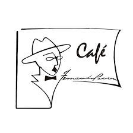

<!DOCTYPE html>
<html lang="en">
<head>
  <meta charset="UTF-8" />
  <meta name="viewport" content="width=device-width, initial-scale=1.0" />
  <title>Salgados da Susy</title>
  
</head>
<body>
  <header>
    
    
    <h1><strong>Salgados da Susy</strong></h1>
    
Salgados Caseiros feitos com carinho e cheios de sabor 

  </header>

  

    

    <h2><strong>Cartão de Visita</strong></h2>
    

      

        <h3><strong>Salgados da Susy</strong></h3>
        
Encomendas para festas, eventos e para o dia-a-dia!

        
<strong>Telefone:</strong> 218 532 659 (temporário)

        
<strong>Instagram:</strong> @fernandopessoacoffeshop

      

    

    <h2>Preços</h2>

    <h3>Salgados Disponíveis</h3>
    <table style="width:100%; border-collapse: collapse; margin: 15px 0;">
      <tr style="background:#e8ddc7; /* bege suave para combinar com os azulejos */">
        <th style="padding:10px; border:1px solid #c2a47b; /* castanho/bege médio */">Salgados</th>
      </tr>
      <tr><td style="padding:10px; border:1px solid #c2a47b; /* castanho/bege médio */">Rissóis de Camarão</td></tr>
      <tr><td style="padding:10px; border:1px solid #c2a47b; /* castanho/bege médio */">Rissóis de Pescada</td></tr>
      <tr><td style="padding:10px; border:1px solid #c2a47b; /* castanho/bege médio */">Rissóis de Carne</td></tr>
      <tr><td style="padding:10px; border:1px solid #c2a47b; /* castanho/bege médio */">Rissóis de Frango com Caril</td></tr>
      <tr><td style="padding:10px; border:1px solid #c2a47b; /* castanho/bege médio */">Croquetes</td></tr>
      <tr><td style="padding:10px; border:1px solid #c2a47b; /* castanho/bege médio */">Almofadas de Queijo e Fiambre</td></tr>
      <tr><td style="padding:10px; border:1px solid #c2a47b; /* castanho/bege médio */">Enrolados de Salsicha</td></tr>
    </table>

    
Salgados (1/2 dúzia) <strong>€ 5,00</strong>

    
Salgados (dúzia) <strong>€ 10,00</strong>

    
Salgados Miniaturas (1/2 dúzia) <strong>€ 5,00</strong>

    
Salgados Miniaturas (dúzia) <strong>€ 10,00</strong>

    
    <h2>Faça sua Encomenda</h2>
    
Entre em contato através do contacto telefónico para encomendar seus salgados fresquinhos!

    
<strong>218 532 659</strong>

